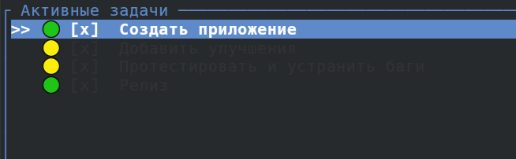
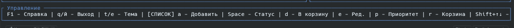
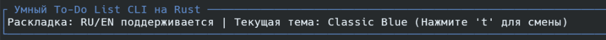

# 📝 ToDoLy

<p align="center">
  
  
  
  
  
</p>

**ToDoLy** — это современный, невероятно быстрый и эстетичный органайзер задач прямо в вашем терминале (TUI). Разработанный на **Rust** с использованием библиотеки **Ratatui**, ToDoLy сочетает в себе олдскульную консольную эстетику и мощные современные технологии.

Ключевая особенность ToDoLy — **встроенный локальный ИИ-ассистент** на базе легковесной нейросети *SmolLM2-135M*, работающий абсолютно автономно на процессоре вашего ПК без необходимости подключения к интернету, отправки ваших данных на сторонние сервера или настройки сторонних утилит типа Ollama.

---

## 📷 Галерея / Интерфейс

Посмотрите на ToDoLy в действии:

| Главный экран (Nordic Theme) | О программе & Обновления (F2) | Локальный ИИ-ассистент (F3 / `i`) |
|:---:|:---:|:---:|
|  |  |  |

---

## ✨ Уникальные Особенности

* 🤖 **Локальный Офлайн-ИИ (SmolLM2-135M):** Разбейте любую сложную цель на подзадачи в одно нажатие клавиши `i`. Модель автоматически скачивается при первом использовании с Hugging Face, кэшируется в вашей системе и генерирует списки дел локально на CPU.
* 🎨 **8 Динамических тем оформления:** Переключайте цветовые палитры на лету нажатием клавиши `t`. Доступны: *Classic Blue, Emerald Green, Cyberpunk Magenta, Nordic Ice, Solarized Amber, Dracula Purple, Sunset Coral* и лаконичный *Monochrome*.
* 📊 **Интерактивный прогресс-бар:** Динамический расчёт выполнения задач в процентах на базе виджета `Gauge`.
* ⌨️ **Двуязычное управление:** Горячие клавиши продублированы и корректно работают как в английской, так и в русской раскладке клавиатуры (`q` / `й`, `d` / `в` и т.д.).
* 🔄 **Умное изменение порядка (Drag & Drop в терминале):** Перемещайте задачи вверх и вниз в списке с помощью `Shift + ↑/↓` или `Shift + J/K`.
* 🔍 **Живой поиск и фильтрация:** Нажмите `/` или `.`, чтобы мгновенно отфильтровать список задач. Навигация автоматически перестроится под отфильтрованный вид.
* ♻️ **Безопасная Корзина (Recycle Bin):** Удаленные задачи попадают в отдельную корзину (`trash.txt`). Вы всегда можете восстановить их или очистить корзину окончательно (с подтверждением).
* 🛡️ **Защита от случайных действий:** Диалоговые окна подтверждения (Да/Нет) для критических операций (удаление навсегда, очистка списка).
* 🔄 **Автопроверка обновлений:** При запуске приложение в неблокирующем фоновом потоке проверяет наличие свежих релизов на GitHub и сообщает о них в окне «О программе».

---

## 🚀 Быстрый старт и Установка

### Требования
* Компилятор **Rust** (`cargo` версии 1.80 или новее).
* Windows, Linux или macOS.

### Сборка и запуск

1. **Клонируйте репозиторий:**
   ```bash
   git clone https://github.com/ZAREZOV2/todoly-tui.git
   cd todoly-tui
   ```

2. **Запустите в режиме разработки:**
   ```bash
   cargo run
   ```
   *Примечание: При первом вызове ИИ-помощника приложение автоматически скачает квантованную модель (~90 МБ) и токенизатор (~2 МБ) с Hugging Face в директорию `~/.todoly-tui/` и сохранит их локально.*

3. **Сборка оптимизированного релиза (.exe для Windows):**
   ```bash
   cargo build --release
   ```
   Готовый автономный бинарный файл будет находиться по пути:
   `target/release/my_cli_tool.exe` (или `todoly-tui.exe`). Вы можете перенести его в любую папку или прописать в PATH.

---

## ⌨️ Управление (Горячие клавиши)

| Клавиша (EN / RU) | Действие |
|:---:|:---|
| **`F1`** | Открыть / Закрыть панель справки (Интерактивный FAQ) |
| **`F2`** | Окно «О программе» (информация о версии, разработчике и обновлениях) |
| **`i`** / **`ш`** | Открыть **ИИ-ассистента** для генерации 5 подзадач по вашему запросу |
| **`a`** / **`ф`** | Добавить новую задачу |
| **`e`** / **`у`** | Редактировать название выбранной задачи |
| **`Space`** / **`Enter`** | Отметить задачу как выполненную / Восстановить задачу из Корзины |
| **`r`** / **`к`** | Переключить режим: Активный список / Корзина |
| **`d`** / **`в`** | Список: Переместить в корзину. Корзина: Удалить навсегда (с подтверждением) |
| **`c`** / **`с`** | Список: Перенести выполненные в корзину. Корзина: Полная очистка (с подтверждением) |
| **`p`** / **`з`** | Сменить приоритет задачи по кругу (🟢 Low ➔ 🟡 Medium ➔ 🟠 High ➔ 🔴 Critical) |
| **`t`** / **`е`** | Сменить цветовую тему интерфейса (8 тем по кругу) |
| **`j` / `k`** | Перемещение вверх / вниз по списку (также работают стрелочки и `о` / `л`) |
| **`Shift + J/K`** | Переместить выбранную задачу выше / ниже по списку (также `Shift + ↑/↓`) |
| **`/`** / **`.`** | Активировать поиск по ключевому слову (Esc — отмена / сброс фильтра) |
| **`q`** / **`й`** | Безопасный выход из приложения с сохранением данных |

---

## 💾 Хранение данных

Все ваши задачи и настройки хранятся в простых текстовых файлах в корневой директории приложения:
* `tasks.txt` — содержит список ваших активных и выполненных задач с метаданными.
* `trash.txt` — список удаленных задач в Корзине.
* Кэш ИИ (`model.gguf` и `tokenizer.json`) хранится в папке пользователя: `~/.todoly-tui/` (для Windows: `C:\Users\<Имя_пользователя>\.todoly-tui\`).

---

## 🤝 Поддержка проекта и Open Source

**ToDoLy** — это полностью бесплатный проект с открытым исходным кодом, созданный с душой для всех любителей минимализма и командной строки. В нём нет рекламы, телеметрии или платных функций.

Если проект делает вашу работу за терминалом более приятной и продуктивной, вы можете выразить свою поддержку автора следующими способами:

1. **⭐ Поставьте звезду репозиторию** — это самый простой и важный способ помочь проекту стать заметнее в сообществе.
2. **💬 Обратная связь и общение** — напишите мне в Discord: **`@console.x`**. Я всегда рад обсудить новые фичи, багрепорты или просто пообщаться о разработке на Rust.
3. **💡 Вклад в код (Contributions):** Если вы хотите добавить фичу, исправить баг или оптимизировать работу ИИ — смело создавайте Issue или Pull Request!
4. **☕ Поддержка автора (Донаты):** Если у вас есть желание поддержать дальнейшее развитие материально (на хостинг, кофе или новые идеи), вы можете связаться со мной в Discord `@console.x` для получения реквизитов. Любая сумма мотивирует тратить больше свободного времени на улучшение и полировку ToDoLy!

---

### Лицензия

Проект распространяется по лицензии **MIT**. Подробности в файле [LICENSE](LICENSE).

---
<p align="center">Сделано с ❤️ для Rust & TUI сообщества.</p>
